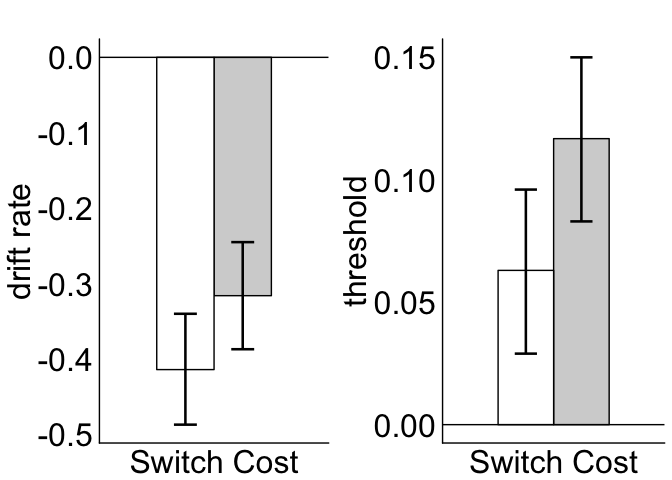
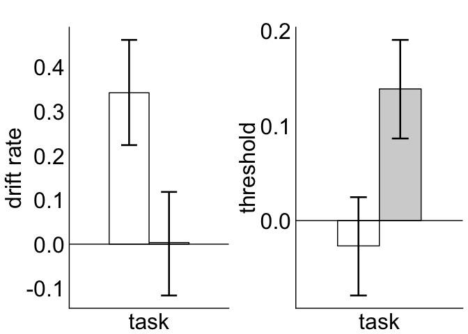
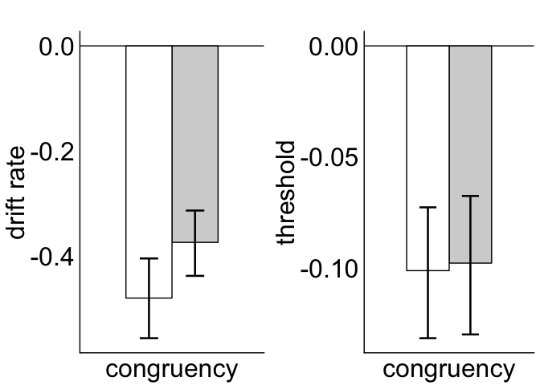
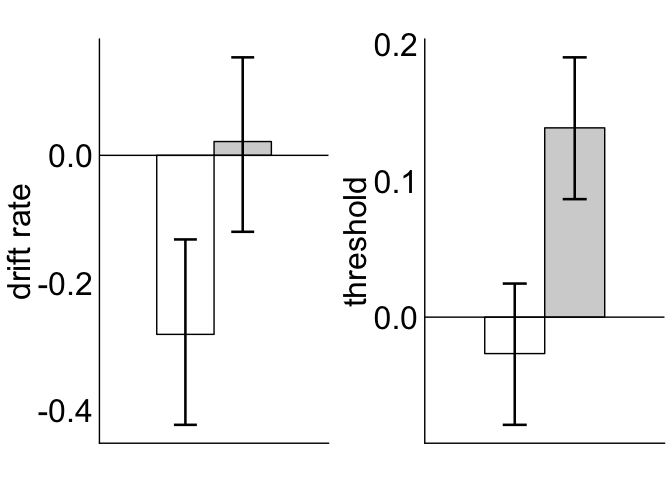
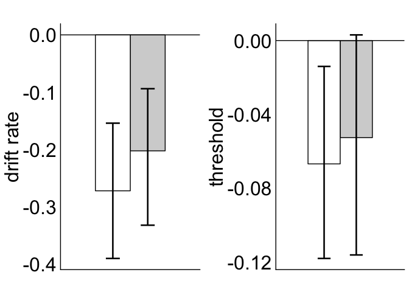

HDDM PLOTS
================

test This notebook was created to plot the hddm parameter outputs for Experiment 1 and Experiment 2 of the Dot Motion task switching paper, with the two interactions Asymmetric switch costs and Switch Costs : Response Congruency.

First we will create data tables with all the effects from the model fits.

Plot Switch Costs for Exp1 & Exp2

``` r
my_hddm_plot = function(data_table, drift_or_threshold){#plot_size, dodge_width, errorbar_size)

P = ggplot(data_table) + aes(data_table =  SC, y = fit, fill=Experiment) + geom_col(aes(SC),color = "black", position=position_dodge(width = 0.5), width = 0.5) +
  scale_fill_manual(values=c('white','lightgray')) + 
  geom_errorbar(data = data_table, aes(SC, ymin = lower, ymax = upper) , width=.2, size = 0.9, position=position_dodge(width = 0.5))+
  xlab("Switch Cost") + 
   ylab(drift_or_threshold) +
   ggtitle("") + 
   theme(plot.title = element_text(lineheight=3, face="bold", color="black", size=plot_size))+
   theme(axis.ticks=element_blank(),axis.title.x=element_blank(), axis.text.y = element_text(size=plot_size,color="black"), text = element_text(size = plot_size), axis.text.x =  element_text(color = "black", size = plot_size), panel.grid.major = element_blank(), panel.grid.minor = element_blank(),panel.background = element_blank()) + theme(legend.title = element_blank())  +  theme(legend.position="none")+
   theme(axis.line.x = element_line(color="black", size = 0.5),
         axis.line.y = element_line(color="black", size = 0.5)) +geom_hline(yintercept = 0)
return(P)
}
```

Now we create the plots we want. First, main Effect for Switch Costs for (1) drift rate and (2) threshold

``` r
SC_drift = my_hddm_plot(DT_Switch_Cost, "drift rate")
SC_threshold = my_hddm_plot(DT_Switch_Cost_Threshold, "threshold")
# put both plots on the same grid
grid.arrange(SC_drift, SC_threshold, nrow = 1, ncol = 2)
```



Second, main Effect for Task for (1) drift rate and (2) threshold

``` r
Task_drift = my_hddm_plot(DT_Task_drift, "drift rate")
Task_threshold = my_hddm_plot(DT_Task_threshold, "threshold")
# put both plots on the same grid
grid.arrange(Task_drift, Task_threshold, nrow = 1, ncol = 2)
```



Third, main Effect for Congruency for (1) drift rate and (2) threshold

``` r
Congruency_drift = my_hddm_plot(DT_congruency, "drift rate")
Congruency_threshold = my_hddm_plot(DT_congruency_threshold, "threshold")
# put both plots on the same grid
grid.arrange(Congruency_drift, Congruency_threshold, nrow = 1, ncol = 2)
```



Now the 2 interactions: First, asymmetric switch costs for (1) drift rate and (2) threshold

``` r
SC_Task = my_hddm_plot(DT_SC_Task, "drift rate")
SC_Task_Threshold = my_hddm_plot(DT_SC_Task_Threshold, "threshold")
# put both plots on the same grid
grid.arrange(SC_Task, SC_Task_Threshold, nrow = 1, ncol = 2)
```



Second, switch costs & response congruence for (1) drift rate and (2) threshold

``` r
Switch_Cost_Congruency = my_hddm_plot(DT_Switch_Cost_Congruency, "drift rate")
Switch_Cost_Congruency_Threshold = my_hddm_plot(DT_Switch_Cost_Congruency_Threshold, "threshold")
# put both plots on the same grid
grid.arrange(Switch_Cost_Congruency, Switch_Cost_Congruency_Threshold, nrow = 1, ncol = 2)
```


